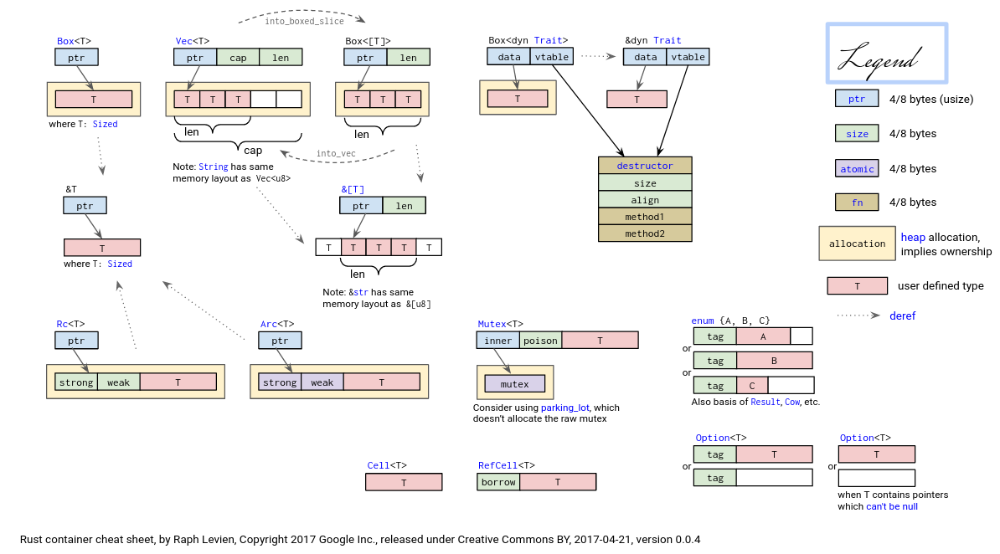

# 2022 Daily schedule of OS Tranining Camp

## Timeline

*July*

| Mon               | Tues              | Wed                          | Thur                         | Fri                          | Sat               | Sun               |
| ----------------- | ----------------- | ---------------------------- | ---------------------------- | ---------------------------- | ----------------- | ----------------- |
|                   |                   |                   |                   | 1 <br> ([D1](#day-1-202271)) | 2 <br> ([D2](#day-2-202272)) | 3 <br> ([D3](#day-3-202273)) | 
|4 <br> ([D4](#day-4-202274)) | 5 <br> ([D5](#day-5-202275)) | 6 <br> ([D6](#day-6-202276)) | 7 <br> ([D7](#day-7-202277)) | 8 <br> ([D8](#day-8-202278))       | 9 <br> ([D9](#day-9-202279))            | 10 <br> ([D10](#day-10-2022710))         | 
|11  <br>  ([D11](#day-11-2022711))             | 12      <br>    ([D12](#day-12-2022712))       | 13    <br>    ([D13](#day-13-2022713))             | 14         <br>    ([D14](#day-14-2020711))        | 15        <br>    ([D15](#day-15-2022715))                    | 16    <br>     ([D16](#day-16-2022716))                       | 17    <br>      ([D17](#day-17-2022717))                       |
|18    <br>    ([D18](#day-18-2020718))            | 19   <br>     ([D19](#day-19-2022719))            | 20   <br>    ([D20](#day-20-2022720))            | 21       <br>    ([D21](#day-21-2022721))         | 22     <br>    ([D22](#day-22-2022722))                         | 23     <br>    ([D23](#day-23-2022723))                         | 24    <br>    ([D24](#day-24-2022724))                        | 
|25      <br>    ([D25](#day-25-2022725))             | 26         <br>    ([D26](#day-26-2022726))           | 27         <br>    ([D27](#day-27-2022727))           | 28       <br>    ([D28](#day-28-2022728))           | 29         <br>    ([D29](#day-29-2022729))                    | 30        <br>    ([D30](#day-30-2022730))                     | 31     <br>    ([D31](#day-31-2022731))                           |

------

## Day 1 2022/7/1

### OS Tranining Camp

在Telegram群里看到了张汉东老师分享的OS训练营链接，因为本科没有好好学习OS课程，最近又看了蒋炎岩老师的几节网课，深受感触，最关键的是这门课程还是用Rust来实现的，遂决定重新学习OS。我从去年就入坑了Rust，当时就是啃steve klabnik的那本TRPL，当时感觉还有这种语言，连书都是开源的，而且配置过程完全无痛，一行命令就完事了。虽然已经啃完了一遍TRPL，但是Rust有些东西还是太难，各种东西很琐碎。最为主要的原因还是缺乏实践。

正好通过这个机会重新认识OS，加深对Rust的理解。

今天在GitHub classroom里配置了项目，之后在codespace中完成了rust，riscv工具链的安装配置，同时正在看lab0-0的文档。

codespace：
* Pros:
    * no need to configure the proxy
    * network speed is fast
* Cons:
    * some bugs
    * rust-analyzer doesn't work well

### Plans: 

完成schedule中的Rust小测试
快速学习riscv相关知识

## Day 2 2022/7/2

### OS Training Camp

虽然codespace很方便，不用配置proxy，但是延迟也太高了吧，而且rust-analyzer还有bug，然后我突然想起来前段时间还有一台闲置的华为云服务器，Ubuntu就是不同折腾，然后将codespace环境迁移到华为云，配置好环境之后就可以干活了。

需要做的不多，无非是换一个源，之后rusttoolchain，riscv重新下载编译，就是这个编译速度有点慢。

* rust-toolchain
  * 使用ustc源
    
    ```shell
    <!-- export RUSTUP_DIST_SERVER=https://mirrors.tuna.edu.cn/rustup
    export RUSTUP_UPDATE_ROOT=https://mirrors.tuna.edu.cn/rustup/rustup -->
    export RUSTUP_DIST_SERVER=https://mirrors.ustc.edu.cn/rust-static
    export RUSTUP_UPDATE_ROOT=https://mirrors.ustc.edu.cn/rust-static/rustup
    ```
  * 安装rust
    ```shell
    curl https://sh.rustup.rs -sSf | sh
    ```
  * 配置cargo，在`~/.cargo/config`中添加：
    ```shell
    <!-- [source.crates-io]
    replace-with = 'tuna'

    [source.tuna]
    registry = "https://mirrors.tuna.tsinghua.edu.cn/git/crates.io-index.git" -->
    [source.crates-io]
    registry = "https://github.com/rust-lang/crates.io-index"
    replace-with = 'ustc'
    [source.ustc]
    registry = "git://mirrors.ustc.edu.cn/crates.io-index"
    ```
* riscv
  * 从官网下载源码
    ```shell
    wget https://download.qemu.org/qemu-7.0.0.tar.xz
    ```
    *解压时用命令* `tar xvJf qemu*`
  * 安装编译所需依赖
    ```shell
    sudo apt install autoconf automake autotools-dev curl libmpc-dev libmpfr-dev libgmp-dev \
              gawk build-essential bison flex texinfo gperf libtool patchutils bc \
              zlib1g-dev libexpat-dev pkg-config  libglib2.0-dev libpixman-1-dev git tmux python3 ninja-build
    ```
  * 编译
    ```shell
    cd qemu-7.0.0
    ./configure --target-list=riscv64-softmmu,riscv64-linux-user
    make -j$(nproc)
    ```
  * 安装
    ```shell
    sudo make install
    ```
    这会将qemu安装到`/usr/local/share`目录下,之后在`~/.zshrc`中添加如下
    ```shell
    export PATH=$PATH:/home/aucker/Downloads/build/qemu-7.0.0/riscv64-softmmu
    export PATH=$PATH:/home/aucker/Downloads/build/qemu-7.0.0/riscv64-linux-user
    export PATH=$PATH:/home/aucker/Downloads/build/qemu-7.0.0
    ```
    之后确认riscv的版本
    ```shell
    ➜  qemu-7.0.0 qemu-system-riscv64 --version
    QEMU emulator version 7.0.0
    Copyright (c) 2003-2022 Fabrice Bellard and the QEMU Project developers
    ➜  qemu-7.0.0 qemu-riscv64 --version
    qemu-riscv64 version 7.0.0
    Copyright (c) 2003-2022 Fabrice Bellard and the QEMU Project developers
    ```

* rCore-Tutorial：

    好像忘记了华为云git不好用，我直接傻眼😯，难道必须要去codespace吗？:cry:其实WSL2也是一个不错的选择:yummy:

```shell
➜  qemu-7.0.0 realpath -s riscv64-mmu
/home/aucker/Downloads/build/qemu-7.0.0/riscv64-mmu
```
`realpath` can get the full path of the file.

## Day 3 2022/7/3

### OS Training Camp

今天跟着教程完成了第一部分的实验。

群友分享了一张关于智能指针的图片：


步骤如下：
* 