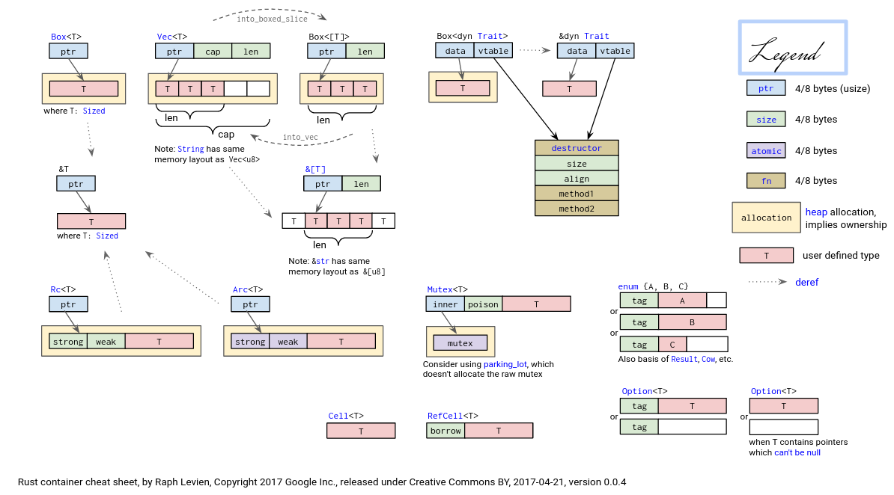
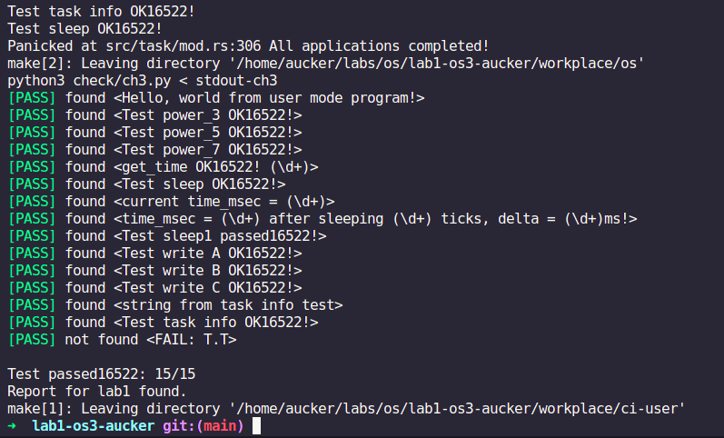
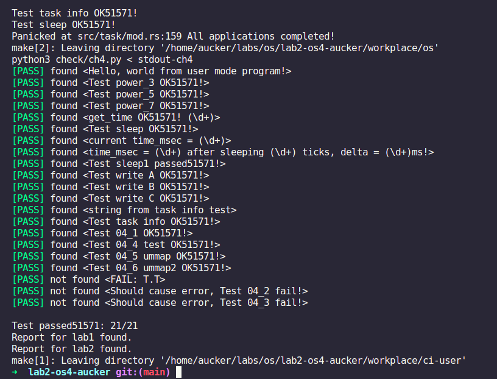
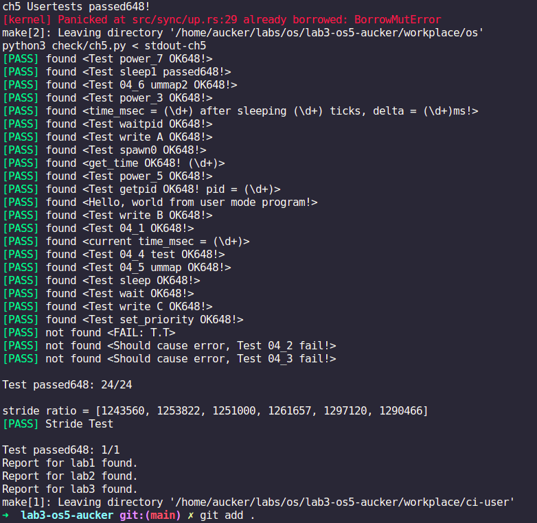

# 2022 Daily schedule of OS Tranining Camp

## Timeline

*July*

| Mon               | Tues              | Wed                          | Thur                         | Fri                          | Sat               | Sun               |
| ----------------- | ----------------- | ---------------------------- | ---------------------------- | ---------------------------- | ----------------- | ----------------- |
|                   |                   |                   |                   | 1 <br> ([D1](#day-1-202271)) | 2 <br> ([D2](#day-2-202272)) | 3 <br> ([D3](#day-3-202273)) | 
|4 <br> ([D4](#day-4-202274)) | 5 <br> ([D5](#day-5-202275)) | 6 <br> ([D6](#day-6-202276)) | 7 <br> ([D7](#day-7-202277)) | 8 <br> ([D8](#day-8-202278))       | 9 <br> ([D9](#day-9-202279))            | 10 <br> ([D10](#day-10-2022710))         | 
|11  <br>  ([D11](#day-11-2022711))             | 12      <br>    ([D12](#day-12-2022712))       | 13    <br>    ([D13](#day-13-2022713))             | 14         <br>    ([D14](#day-14-2020711))        | 15        <br>    ([D15](#day-15-2022715))                    | 16    <br>     ([D16](#day-16-2022716))                       | 17    <br>      ([D17](#day-17-2022717))                       |
|18    <br>    ([D18](#day-18-2020718))            | 19   <br>     ([D19](#day-19-2022719))            | 20   <br>    ([D20](#day-20-2022720))            | 21       <br>    ([D21](#day-21-2022721))         | 22     <br>    ([D22](#day-22-2022722))                         | 23     <br>    ([D23](#day-23-2022723))                         | 24    <br>    ([D24](#day-24-2022724))                        | 
|25      <br>    ([D25](#day-25-2022725))             | 26         <br>    ([D26](#day-26-2022726))           | 27         <br>    ([D27](#day-27-2022727))           | 28       <br>    ([D28](#day-28-2022728))           | 29         <br>    ([D29](#day-29-2022729))                    | 30        <br>    ([D30](#day-30-2022730))                     | 31     <br>    ([D31](#day-31-2022731))                           |

------

## Day 1 2022/7/1

### OS Tranining Camp

在Telegram群里看到了张汉东老师分享的OS训练营链接，因为本科没有好好学习OS课程，最近又看了蒋炎岩老师的几节网课，深受感触，最关键的是这门课程还是用Rust来实现的，遂决定重新学习OS。我从去年就入坑了Rust，当时就是啃steve klabnik的那本TRPL，当时感觉还有这种语言，连书都是开源的，而且配置过程完全无痛，一行命令就完事了。虽然已经啃完了一遍TRPL，但是Rust有些东西还是太难，各种东西很琐碎。最为主要的原因还是缺乏实践。

正好通过这个机会重新认识OS，加深对Rust的理解。

今天在GitHub classroom里配置了项目，之后在codespace中完成了rust，riscv工具链的安装配置，同时正在看lab0-0的文档。

codespace：
* Pros:
    * no need to configure the proxy
    * network speed is fast
* Cons:
    * some bugs
    * rust-analyzer doesn't work well

### Plans: 

完成schedule中的Rust小测试
快速学习riscv相关知识

## Day 2 2022/7/2

### OS Training Camp

虽然codespace很方便，不用配置proxy，但是延迟也太高了吧，而且rust-analyzer还有bug，然后我突然想起来前段时间还有一台闲置的华为云服务器，Ubuntu就是不同折腾，然后将codespace环境迁移到华为云，配置好环境之后就可以干活了。

需要做的不多，无非是换一个源，之后rusttoolchain，riscv重新下载编译，就是这个编译速度有点慢。

* rust-toolchain
  * 使用ustc源
    
    ```shell
    <!-- export RUSTUP_DIST_SERVER=https://mirrors.tuna.edu.cn/rustup
    export RUSTUP_UPDATE_ROOT=https://mirrors.tuna.edu.cn/rustup/rustup -->
    export RUSTUP_DIST_SERVER=https://mirrors.ustc.edu.cn/rust-static
    export RUSTUP_UPDATE_ROOT=https://mirrors.ustc.edu.cn/rust-static/rustup
    ```
  * 安装rust
    ```shell
    curl https://sh.rustup.rs -sSf | sh
    ```
  * 配置cargo，在`~/.cargo/config`中添加：
    ```shell
    <!-- [source.crates-io]
    replace-with = 'tuna'

    [source.tuna]
    registry = "https://mirrors.tuna.tsinghua.edu.cn/git/crates.io-index.git" -->
    [source.crates-io]
    registry = "https://github.com/rust-lang/crates.io-index"
    replace-with = 'ustc'
    [source.ustc]
    registry = "git://mirrors.ustc.edu.cn/crates.io-index"
    ```
* riscv
  * 从官网下载源码
    ```shell
    wget https://download.qemu.org/qemu-7.0.0.tar.xz
    ```
    *解压时用命令* `tar xvJf qemu*`
  * 安装编译所需依赖
    ```shell
    sudo apt install autoconf automake autotools-dev curl libmpc-dev libmpfr-dev libgmp-dev \
              gawk build-essential bison flex texinfo gperf libtool patchutils bc \
              zlib1g-dev libexpat-dev pkg-config  libglib2.0-dev libpixman-1-dev git tmux python3 ninja-build
    ```
  * 编译
    ```shell
    cd qemu-7.0.0
    ./configure --target-list=riscv64-softmmu,riscv64-linux-user
    make -j$(nproc)
    ```
  * 安装
    ```shell
    sudo make install
    ```
    这会将qemu安装到`/usr/local/share`目录下,之后在`~/.zshrc`中添加如下
    ```shell
    export PATH=$PATH:/home/aucker/Downloads/build/qemu-7.0.0/riscv64-softmmu
    export PATH=$PATH:/home/aucker/Downloads/build/qemu-7.0.0/riscv64-linux-user
    export PATH=$PATH:/home/aucker/Downloads/build/qemu-7.0.0
    ```
    之后确认riscv的版本
    ```shell
    ➜  qemu-7.0.0 qemu-system-riscv64 --version
    QEMU emulator version 7.0.0
    Copyright (c) 2003-2022 Fabrice Bellard and the QEMU Project developers
    ➜  qemu-7.0.0 qemu-riscv64 --version
    qemu-riscv64 version 7.0.0
    Copyright (c) 2003-2022 Fabrice Bellard and the QEMU Project developers
    ```

* rCore-Tutorial：

    好像忘记了华为云git不好用，我直接傻眼😯，难道必须要去codespace吗？:cry:其实WSL2也是一个不错的选择:yum:

```shell
➜  qemu-7.0.0 realpath -s riscv64-mmu
/home/aucker/Downloads/build/qemu-7.0.0/riscv64-mmu
```
`realpath` can get the full path of the file.

## Day 3 2022/7/3

### OS Training Camp

**注：** 以下操作均为在GitHub codespace中执行的结果

群友分享了一张关于智能指针的图片：


今天跟着教程完成了第一部分的实验。

**应用程序执行环境**

在通用操作系统(如Linux)上运行应用程序，需要多层次的执行环境栈支持：


编译器在编译、链接得到可执行文件时需要知道，程序要在哪个**平台Platform**上运行，**目标三元组Target Triplet**描述了目标平台的CPU指令集、操作系统类型和标准运行时库。

```shell
➜ rustc --version --verbose
rustc 1.61.0 (fe5b13d68 2022-05-18)
binary: rustc
commit-hash: fe5b13d681f25ee6474be29d748c65adcd91f69e
commit-date: 2022-05-18
host: x86_64-unknown-linux-gnu
release: 1.61.0
LLVM version: 14.0.0
```
`host`表明目标默认平台是`x86_64-unknown-linux-gnu`,CPU架构是x86_64，厂商unknown，操作系统为Linux，运行时库为gnu libc。

实验一的目的是将初始程序移植到RISCV目标平台`riscv64gc-unknown-none-elf`上运行。

其中，`elf`表示没有标准的运行时库。没有任何系统调用的封装支持，但可以生成ELF格式的执行程序。不选择有`linux-gnu`支持的`riscv64gc-unknown-linux-gnu`，是因为我们的目标是开发操作系统内核而非在Linux操作系统上执行应用程序。

**修改目标平台**

将程序的目标平台换成`riscv64gc-unknown-none-elf`，执行命令：
```shell
➜  os git:(main) ✗ cargo run --target riscv64gc-unknown-none-elf
   Compiling os v0.1.0 (/home/aucker/rust-learning/OS_lab/my_os_toy/os)
error[E0463]: can't find crate for `std`
  |
  = note: the `riscv64gc-unknown-none-elf` target may not be installed
  = help: consider downloading the target with `rustup target add riscv64gc-unknown-none-elf`
```

报错的原因是目标平台上确实没有Rust标准库std，也不存在任何受OS支持的系统调用。这样的平台被称作**裸机平台 bare-metal**。Luckily，Rust还有一个不需要任何操作系统支持的核心库**core**，它包含了Rust的相当一部分核心机制。有很多第三方库也不依赖标准库std，而仅仅依赖核心库core。

步骤如下：

* **Remove the dependency of the std library**

  首先在`os`目录下新建`.cargo`目录，并在这个目录下创建`config`文件，内容如下：

  ```toml
  [build]
  target = "riscv64gc-unknown-none-elf"
  ```

  这将使cargo工具在os目录下默认会使用riscv64gc-unknown-none-elf作为目标平台。这种编译器运行的平台(x86_64)与可执行文件运行的目标平台不同的情况，称为**交叉编译 Cross Compile**。

  * Remove `println!()`
  我们在`main.rs`开头加上`#![no_std]`，这样编译器就不会使用标准库std,转而使用核心库`core`。
  * Provide `panic_handler()` 
  标准库std提供了Rust错误处理函数#[panic_handler]，这个函数会在程序出现错误时被调用,打印出错位置和原因并杀死当前应用。core库中并没有这项功能，所以我们需要自己实现这个函数。
    ```rust
    // os/src/lang_items.rs
    use core::panic::PanicInfo;

    #[panic_handler]
    fn panic_handler(_info: &PanicInfo) -> ! {
      loop {}
    }
    ```
  * Remove `main()`
  Then we build this program again, we got the following errors:
    > **Error**
    >
    > ```shell
    > ➜  os git:(main) ✗ cargo build
    > Compiling os v0.1.0 (/home/aucker/rust-learning/OS_lab/my_os_toy/os)
    > error: requires `start` lang_item
    > 
    > error: could not compile `os` due to previous error
    > ```
    we need `start`. `start` represents what `std` library needs to do some initialization work before executing a program.

    We add `#![no_main]` to inform the compiler that we don't have a `main` function. And compiler don't need to consider the initialization work. 

    Now, we finally remove all the `std` library dependencies, the codes look like this:
    ```rust
    // os/src/main.rs
    #![no_std]
    #![no_main]

    mod lang_items;

    // os/src/lang_items.rs
    use core::panic::PanicInfo;

    #[panic_handler]
    fn panic_handler(_info: &PanicInfo) -> ! {
      loop {}
    }
    ```

  * Analyze the program that was removed the `std` library
  
    We need `rust-readobj`, use `cargo install rust-readobj` to install it.
  
    We can use some tools to analyze the program:
  
    ```shell
    ➜  os git:(main) ✗ file target/riscv64gc-unknown-none-elf/debug/os           
    target/riscv64gc-unknown-none-elf/debug/os: ELF 64-bit LSB executable, UCB RISC-V, version 1 (SYSV), statically linked, with debug_info, not stripped
    ➜  os git:(main) ✗ rust-readobj -h target/riscv64gc-unknown-none-elf/debug/os

    File: target/riscv64gc-unknown-none-elf/debug/os
    Format: elf64-littleriscv
    Arch: riscv64
    AddressSize: 64bit
    LoadName: <Not found>
    ElfHeader {
      Ident {
        Magic: (7F 45 4C 46)
        Class: 64-bit (0x2)
        DataEncoding: LittleEndian (0x1)
        FileVersion: 1
        OS/ABI: SystemV (0x0)
        ABIVersion: 0
        Unused: (00 00 00 00 00 00 00)
      }
    Type: Executable (0x2)
    Machine: EM_RISCV (0xF3)
    Version: 1
    Entry: 0x0
    ProgramHeaderOffset: 0x40
    SectionHeaderOffset: 0x1B40
    Flags [ (0x5)
      EF_RISCV_FLOAT_ABI_DOUBLE (0x4)
      EF_RISCV_RVC (0x1)
    ]
    HeaderSize: 64
    ProgramHeaderEntrySize: 56
    ProgramHeaderCount: 3
    SectionHeaderEntrySize: 64
    SectionHeaderCount: 14
    StringTableSectionIndex: 12
    }
    ➜  os git:(main) ✗ rust-objdump -S target/riscv64gc-unknown-none-elf/debug/os

    target/riscv64gc-unknown-none-elf/debug/os:     file format elf64-littleriscv
    ```

    通过`file`对二进制文件`os`的分析可以看到，它好像是一个合法的RV64执行程序，但`rust-readobj`显示它的入口地址Entry是`0`.再通过`rust-objdump`对它反汇编，没有生成任何汇编代码。可见该二进制程序虽然合法，但它是一个空程序，原因是缺少了编译器规定的入口函数`_start`。

* **构建用户态执行环境**

> **Note**
> QEMU has two running mode:
> `User mode`, such as `qemu-riscv64`, it can simulate different CPUs' User mode instructions execution, and directly parse ELF executable file, load and execute user mode Linux applications.
> `System mode`, such as `qemu-system-riscv64`, it can simulate a complete hardware system based on different CPUs, including CPU, memory, peripherals, and so on. 


### Day 4 2022/7/4

今天重新回顾了rustling

**Plans：** 完成rustling中的练习题

### Day 5 2022/7/5

今天的目标是完成rustlings中的练习题

* Shadowing in Rust
https://doc.rust-lang.org/book/ch03-01-variables-and-mutability.html#shadowing

* CONSTANT
const must come with a TYPE annotation.
https://doc.rust-lang.org/book/ch03-01-variables-and-mutability.html#constants


### Day 6 2022/7/6

[Ownership in Rust: References and Borrowing](https://doc.rust-lang.org/stable/book/ch04-02-references-and-borrowing.html)

```rust
// move_semantics.rs

fn main() {
    let data = "Rust is great!".to_string();

    get_char(&data);

    string_uppercase(data);
}

// Should not take ownership
fn get_char(data: &String) -> char {
    data.chars().last().unwrap()
}

// Should take ownership
fn string_uppercase(mut data: String) {
    data = data.to_uppercase();

    println!("{}", data);
}
```

In Rust, `String` doesn't implement `Copy` trait, so it can't be copied.

Get a slice out of an array:
```rust
// primitive_types4.rs
#[test]
fn slice_out_of_array() {
    let a = [1, 2, 3, 4, 5];

    let nice_slice = &a[1 .. 4];

    assert_eq!([2, 3, 4], nice_slice)
}
```

The [Tuple Type](https://doc.rust-lang.org/book/ch03-02-data-types.html#the-tuple-type) is awesome！

```rust
// primitive_types5.rs
fn main() {
  let cat = ("Furry McFurson", 3.5);
  let (name, age)/* your pattern here */ = cat;

  println!("{} is {} years old.", name, age);
}
```

The different [Structs](https://doc.rust-lang.org/book/ch05-01-defining-structs.html) in Rust.

```rust
// structs.rs

struct ColorClassicStruct {
    name: String,
    hex: String,
}
struct ColorTupleStruct<'a, 'b>(&'a str, &'b str);
// well, well, well, here comes with lifetime variables
#[derive(Debug)]
struct UnitStruct;

let green = ColorClassicStruct {
    // name: "green".to_string(),
    // hex: "#00FF00".to_string(),
    name: String::from("green"),
    hex: String::from("#00FF00"),
};

let green = ColorTupleStruct("green", "#00FF00");

let unit_struct = UnitStruct;
```

enum3.rs in Rustlings is very interesting for reference. Use the [match](https://doc.rust-lang.org/book/ch18-03-pattern-syntax.html?highlight=match#multiple-patterns) in Rust.

Plus, modules3.rs in Rustlings is also interesting to implement.

Remember the initialization of HashMap:
```rust
// hashmap.rs
let mut basket = HashMap::new();
basket.insert("apple", 1);
```

**Rustlings**: finish the 66% of rustlings exercises.

### Day 7 2022/7/7

**Rustlings**: I'll finish the rest of the rustlings exercises.

The trait `std::fmt::Display` is not implemented for `HashMap` and `Option<Option<i8>>`.

So in format strings use `{:?}` instead of `{}`.

Option is so hard.

### Day 8 2022/7/8

Finished the rustlings tests, but some questions still not quite understood.

Plus, I finished lab0-1

### Day 9 2022/7/9

* 完成了rustlings的内容，同时完成了实验先导lab0。
* 之前在WSL2中配置的ubuntu20.04用vscode本来挺舒服的，但是后来发现16G的内存开几个vscode就卡起来了，资源管理器中vemm内存占用极高，而华为云服务器又不能正常使用github，因此最终决定在ubuntu上完成接下来的实验。
* All in ubuntu。完成ubuntu的安装以及所需软件的安装配置。

### Day 10 2022/7/10

* 开始进行lab1的实验，对照实验手册将lab1中的代码看懂，并熟悉代码结构
* 开始学习熟悉risc-v中的相关指令和汇编代码
* 学习rust的

### Day 11 2022/7/11

```rust
// syscall/process.rs
/// YOUR JOB: Finish sys_task_info to pass testcases
pub fn sys_task_info(ti: *mut TaskInfo) -> isize {
    // -1
    set_task_info(ti);
    0
}
```

* 通过了lab1的CI测试



### Day 12 2022/7/12

### Day 13 2022/7/13

### Day 14 2022/7/14

### Day 15 2022/7/15

```rust
// syscall/process.rs
// YOUR JOB: 引入虚地址后重写 sys_get_time
pub fn sys_get_time(ts: *mut TimeVal, _tz: usize) -> isize {
    let us = get_time_us();
    // unsafe {
    //     *ts = TimeVal {
    //         sec: us / 1_000_000,
    //         usec: us % 1_000_000,
    //     };
    // }
    translated_assign_ptr(
        current_user_token(),
        ts,
        TimeVal {
            sec: us / 1_000_000,
            usec: us % 1_000_000,
        }
    );
    0
}

...

// YOUR JOB: 扩展内核以实现 sys_mmap 和 sys_munmap
pub fn sys_mmap(start: usize, len: usize, port: usize) -> isize {
    // -1
    mmap_in_current_memory_set(start, len, port)
}

pub fn sys_munmap(start: usize, len: usize) -> isize {
    // -1
    munmap_in_current_memory_set(start, len)
}

// YOUR JOB: 引入虚地址后重写 sys_task_info
pub fn sys_task_info(ti: *mut TaskInfo) -> isize {
    // -1
    translated_assign_ptr(
        current_user_token(),
        ti,
        get_task_info()
    );
    0
}
```

### Day 16 2022/7/16

* 通过了lab2的CI测试



### Day 17 2022/7/17

### Day 18 2022/7/18

### Day 19 2022/7/19

### Day 20 2022/7/20

### Day 21 2022/7/21

### Day 22 2022/7/22

### Day 23 2022/7/23

### Day 24 2022/7/24

### Day 25 2022/7/25

### Day 26 2022/7/26

### Day 27 2022/7/27

```rust
/// YOUR JOB: 引入虚地址后重写 sys_get_time
pub fn sys_get_time(ts: *mut TimeVal, _tz: usize) -> isize {
    let us = get_time_us();
    let bufs = translated_large_type::<TimeVal>(current_user_token(), ts);
    unsafe {
        copy_type_into_bufs::<TimeVal>(
            &TimeVal {
                sec: us / 1_000_000,
                usec: us % 1_000_000,
            },
            bufs
        );
    }
    0
}

...

// YOUR JOB: 引入虚地址后重写 sys_task_info
pub fn sys_task_info(ti: *mut TaskInfo) -> isize {
  ...

// YOUR JOB: 实现sys_set_priority，为任务添加优先级
pub fn sys_set_priority(prio: isize) -> isize {
  ...

// YOUR JOB: 扩展内核以实现 sys_mmap 和 sys_munmap
pub fn sys_mmap(start: usize, len: usize, port: usize) -> isize {
  ...
pub fn sys_munmap(start: usize, len: usize) -> isize {
  ...

// YOUR JOB: 实现 sys_spawn 系统调用
// ALERT: 注意在实现 SPAWN 时不需要复制父进程地址空间，SPAWN != FORK + EXEC 
pub fn sys_spawn(path: *const u8) -> isize {
  ...
```

### Day 28 2022/7/28

* 通过了lab3的CI测试



### Day 29 2022/7/29

### Day 30 2022/7/30

### Day 31 2022/7/31
